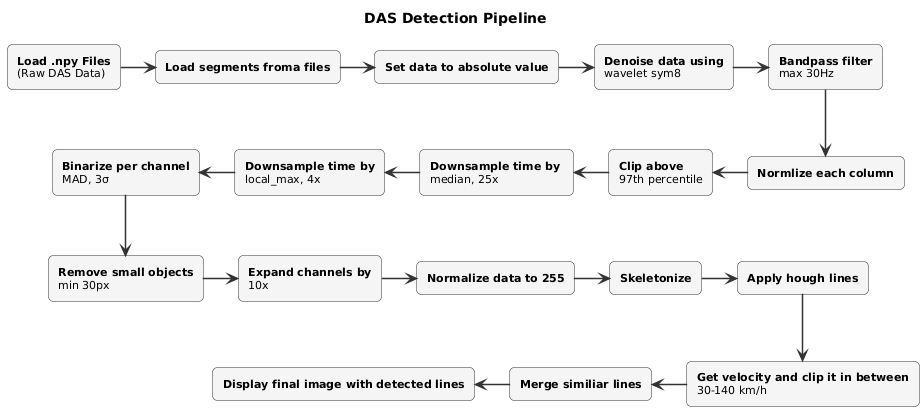

# DAS Vehicle Tracking

Detecting moving vehicles in Distributed Acoustic Sensing (DAS) data using classical
computer vision. A car driving next to the fibre shows up as a diagonal line in the
space-time image, and the slope of that line tells us how fast it was going.

Jakub Laskowski (160287), Jakub Górniak (160326)



## Problem

A DAS interrogator turns a fibre-optic cable into thousands of virtual acoustic
sensors. If you stack the channels (space) against the samples (time) you get an
image where a passing vehicle draws a straight line - the gradient is the velocity,
the offset is when it passed.

The hard part is that the raw data is mostly noise, the channels have very different
sensitivity (channel 26 in this recording is way too sensitive and the neighbouring
channels overlap in magnitude), and the thing we are looking for is a faint thin line,
not a nice object. There is no deep learning here, it is all signal processing plus
classical CV.

## Pipeline

| Stage | Method |
| ----- | ------ |
| Loading | Load the .npy files for a time segment into a space-time frame |
| Outlier control | Percentile clipping |
| Denoising | Wavelet shrinkage per channel (`sym8`, level 6, garrote) |
| Normalisation | Per-column normalisation and rescale to 8-bit |
| Downsampling | Max-pool / max-then-mean / median pooling in time and space |
| Binarisation | Per-channel thresholding (MAD or std based) |
| Cleanup | Removing small connected components |
| Detection | Skeletonisation, then Hough line transform with 360 angle bins |
| Post-processing | Merging lines by angle and distance |
| Output | Lines + velocity estimated from the slope |

### What we learned

- Per-channel binarisation made the biggest difference. With a global threshold the
  thin lines just disappeared, thresholding each channel against its own noise
  brought them back.
- Skeletonisation helps the Hough peaks a lot, but it also creates several
  duplicated collinear lines for one car. That is what `merge_lines` is for, it
  clusters them by angle and distance and averages them weighted by the accumulator.
- The frequency domain approach did not really work. Band-passing the signal to
  isolate the lines in the spectrogram was clearly worse than the spatial pipeline.
  The spectrograms do show that the information is there, so a frequency-first
  pipeline might still be worth trying.

### Limitations

Thick lines with good SNR are detected reliably, but we still miss a lot of the thin
low-energy ones. We think getting those would need a different pipeline rather than
more parameter tuning.

## Getting started

```bash
git clone https://github.com/Laskya/das-vehicle-tracking.git
cd das-vehicle-tracking

python -m venv .venv && source .venv/bin/activate
pip install -r requirements.txt
```

### Using the code

The pipeline is in the `das` package so you can use it without the notebook:

```python
from das import PipelineConfig, detect_tracks, load_segment, plot_das_with_lines

df = load_segment(segment=0, files=files)
result = detect_tracks(df, PipelineConfig())

print(f'{len(result.lines)} tracks detected')
plot_das_with_lines(df, result.lines, processed_shape=result.detection_image.shape)
```

`PipelineConfig` has the parameters we used for the results, and `result.stages`
keeps every intermediate frame so you can look at any step.

### Running the notebook

```bash
jupyter notebook cv_project1_final_improved.ipynb
```

The first cell downloads the dataset from Google Drive, then it runs top to bottom:
first the analysis (channel magnitudes, spectrograms of the whole recording and of
single segments), then the detection and the plots.

### Linting

```bash
ruff check .
```

## Repository structure

```
.
├── das/
│   ├── config.py                      # dx, dt, velocity limits
│   ├── io.py                          # loading segments
│   ├── signal.py                      # denoising, band-pass, normalisation, pooling
│   ├── detection.py                   # binarisation, Hough, line merging
│   ├── plotting.py                    # all the plots
│   └── pipeline.py                    # PipelineConfig + detect_tracks
├── cv_project1_final_improved.ipynb   # analysis + the whole pipeline
├── cv_project1_final_improved.html    # rendered notebook, no need to run anything
└── das_plantuml.png                   # pipeline diagram
```

## Libraries used

NumPy, pandas, OpenCV, scikit-image (Hough transform, skeletonisation, connected
components), PyWavelets, SciPy.
